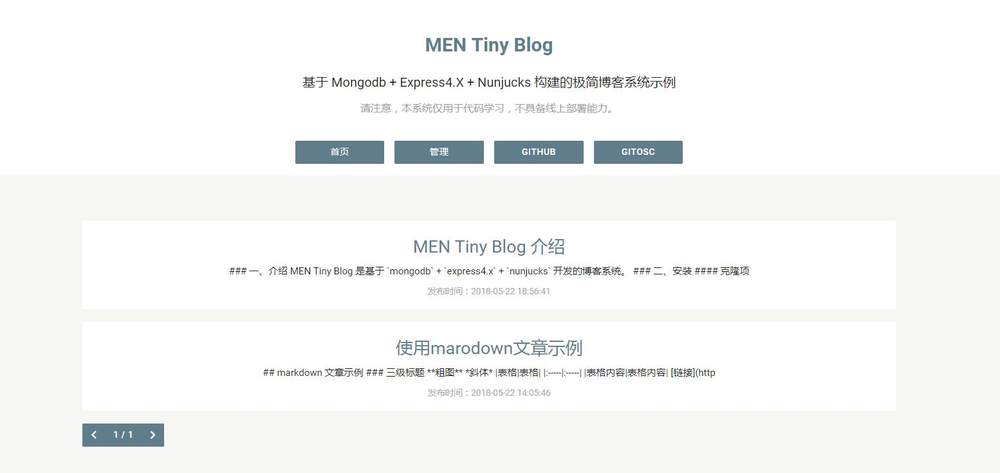
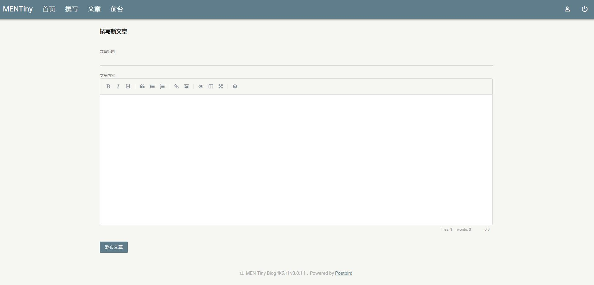
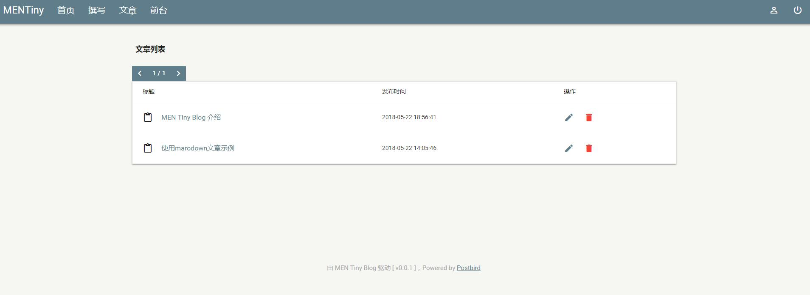
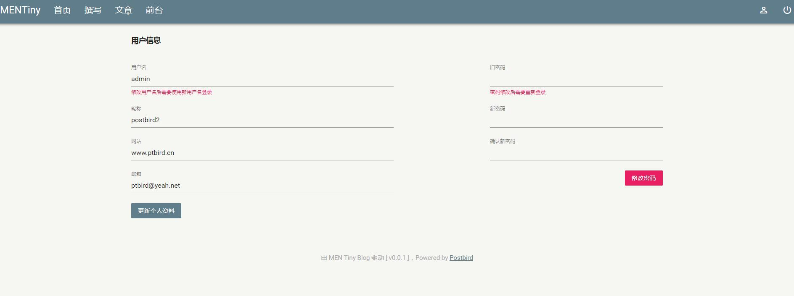

## MEN Tiny Blog


### 一、介绍

MEN Tiny Blog 是基于 `mongodb` + `express4.x` + `nunjucks` 开发的博客系统。
> 本系统不具备上线能力，仅用于 Express4.X + mongodb 代码学习和练手

在线demo：

- [http://mentinyblog.ptbird.cn:3000/](http://mentinyblog.ptbird.cn:3000/)

### 二、安装

#### 克隆项目

```bash
git clone https://github.com/postbird/MENTinyBlog.git
```

#### 安装依赖

```bash
yarn install
```

#### 修改数据库配置文件

文件地址： `/config/database.js`

```javascript
module.exports = {
    host:'192.168.158.128',
    port:27017,
    database:'mentinyblog',
    user:'root',
    password:'123456',
    noAuth:true, // mongodb 无需进行密码校验
};
```


#### 初始化管理员信息

第一次使用，需要初始化并写入管理员的初始信息、

管理员初始信息可以在 `/config/initAdmin.js` 配置，密码是 `sha256+密钥加密后的结果`

```javascript
module.exports = {
    "name":"admin",
    "nickname":"MENTinyBlog", // 123456
    "password":"7cde784f9cf1d15e0785437af7c6ee3589dba4e9fa3729025bd0f6781aba14dd",
    "site":"http://www.ptbird.cn",
    "email":"ptbird@yeah.net"
};
```

#### 执行初始化操作

```bash
yarn installBlog
```

### 三、开发


#### 开启开发模式

```bash
yarn dev
```

### 四、效果










### 五、LICENSE

MIT